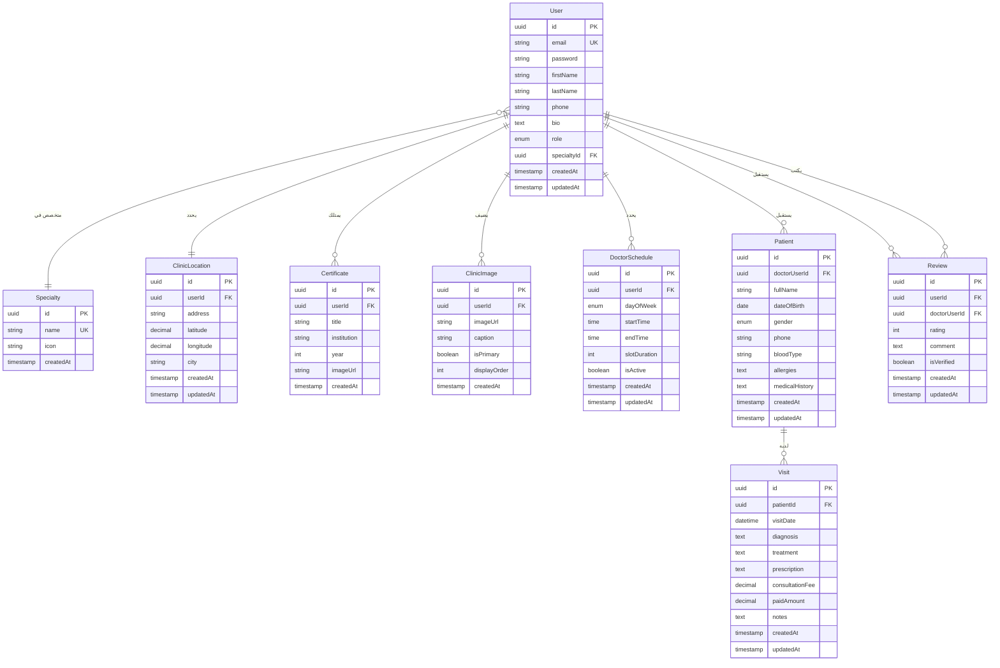

# 🏥 Tabebena - Entity Relationship Diagram (ERD)

## 📊 مخطط العلاقات الكامل



---

## 📋 شرح العلاقات بالتفصيل (بعد تطبيق Normalization)

### 🔵 **1. User (المستخدم/الطبيب)**
- **One-to-One** مع:
  - `ClinicLocation` - يحدد موقع العيادة
- **One-to-Many** مع:
  - `Certificate` - يمتلك عدة شهادات
  - `ClinicImage` - يضيف عدة صور للعيادة
  - `DoctorSchedule` - يحدد أوقات العمل
  - `Patient` - يستقبل عدة مرضى
  - `Review` - يستقبل عدة تقييمات
- **Many-to-One** مع:
  - `Specialty` - متخصص في تخصص واحد
  - `role` - يمتلك دوراً واحداً (طبيب، مريض، إلخ)

### 🟢 **2. Patient (المريض)**
- **Many-to-One** مع `User` - مسجل عند طبيب واحد (من خلال `doctorUserId`)
- **One-to-Many** مع `Visit` - لديه عدة زيارات

### 🟡 **3. Visit (الزيارة)**
- **Many-to-One** مع `Patient` - تخص مريض واحد
- **One-to-Many** مع `Review` - قد تحتوي على تقييم

### 🔴 **4. Review (التقييم)**
- **Many-to-One** مع `User` - يكتبه مستخدم واحد
- **Many-to-One** مع `User` - يخص طبيب واحد (من خلال `doctorUserId`)

### 🟤 **5. ClinicLocation (موقع العيادة)**
- **One-to-One** مع `User` - كل عيادة تخص مستخدماً واحداً (طبيب)

---

## 🔑 الحقول المهمة

### **Primary Keys (PK)**
جميع الجداول تستخدم `UUID` كمفتاح أساسي لضمان الأمان والتوزيع.

### **Foreign Keys (FK)**
- `userId` - في: ClinicLocation, Certificate, ClinicImage, DoctorSchedule, Review
- `doctorUserId` - في: Patient, Review
- `patientId` - في: Visit
- `specialtyId` - في: User

### **Unique Keys (UK)**
- `email` - في: User
- `name` - في: Specialty
- `doctorId` - في: ClinicLocation (كل طبيب له موقع واحد فقط)

---

## 📊 إحصائيات المشروع (بعد التبسيط الكامل)

| العنصر | العدد |
|--------|-------|
| **عدد الجداول** | 9 جداول ✅ |
| **عدد العلاقات** | 9 علاقات |
| **One-to-One** | 1 (Doctor ↔ ClinicLocation) |
| **One-to-Many** | 7 |
| **Many-to-One** | 8 |
| **اللغة** | عربي فقط 🇸🇾 |
| **التعقيد** | بسيط جداً ⭐ |

---

City {
  id PK
  nameAr: "دمشق"           -- ✅ جدول منفصل
  nameEn: "Damascus"
}

Doctor {
  cityId FK                -- ✅ علاقة مباشرة مع المدينة
  clinicAddress: "المزة - شارع الجلاء"  -- العنوان التفصيلي
}
```

**النتيجة:** تبسيط البنية - استخدام المدن فقط بدون مناطق فرعية.

---

### 📐 **3NF (Third Normal Form) - الشكل الطبيعي الثالث**

✅ **تم تطبيقه بنجاح:**

#### **قبل التطبيع:**
```sql
Doctor {
  averageRating: 4.5       -- ❌ بيانات محسوبة من جدول آخر
  totalReviews: 120        -- ❌ بيانات محسوبة من جدول آخر
}

Visit {
  consultationFee: 200
  paidAmount: 150
  remainingAmount: 50      -- ❌ بيانات محسوبة (Fee - Paid)
}
```

#### **بعد التطبيع:**
```sql
Doctor {
  -- تم حذف averageRating و totalReviews
  -- يتم حسابها من جدول Review عند الحاجة
}

Visit {
  consultationFee: 200
  paymentStatus: "partial"
  -- تم حذف paidAmount و remainingAmount
}

VisitPayment {
  visitId FK
  amount: 150              -- ✅ جدول منفصل للدفعات (نقدي فقط)
  paymentDate
  -- تم حذف paymentMethod (الدفع نقدي فقط في سوريا)
}
```

**النتيجة:** لا توجد تبعيات متعدية (Transitive Dependencies).

---

### 📐 **BCNF (Boyce-Codd Normal Form)**

✅ **تم تطبيقه بنجاح:**

#### **قبل التطبيع:**
```sql
Visit {
  patientId FK
  doctorId FK              -- ❌ تكرار (موجود في Patient)
}
```

#### **بعد التطبيع:**
```sql
Visit {
  patientId FK             -- ✅ doctorId يُستخرج من Patient
  -- يمكن الوصول للطبيب عبر: Visit -> Patient -> Doctor
}
```

**النتيجة:** كل محدد (Determinant) هو مفتاح مرشح (Candidate Key).

---

### 📐 **4NF (Fourth Normal Form) - فصل العلاقات متعددة القيم**

✅ **تم تطبيقه بنجاح:**

#### **قبل التطبيع:**
```sql
Visit {
  prescription: "دواء1: 500mg مرتين يوميًا، دواء2: 250mg مرة يوميًا"  -- ❌
}
```

#### **بعد التطبيع:**
```sql
Medication {
  id PK
  nameAr: "باراسيتامول"   -- ✅ جدول منفصل للأدوية
}

Prescription {
  visitId FK
  medicationId FK          -- ✅ علاقة Many-to-Many
  dosage: "500mg"
  frequency: "مرتين يوميًا"
}
```

**النتيجة:** لا توجد تبعيات متعددة القيم (Multi-Valued Dependencies).

---

## 🎯 ملاحظات تصميمية

### ✅ **نقاط القوة بعد Normalization**
1. **فصل واضح** بين المستخدمين والأطباء
2. **مرونة عالية** في إضافة الشهادات والصور
3. **تتبع كامل** لتاريخ المرضى والزيارات
4. **نظام تقييم موثوق** مربوط بالمستخدمين
5. **دعم متعدد اللغات** (عربي/إنجليزي)
6. **✨ لا توجد بيانات مكررة** (No Redundancy)
7. **✨ سهولة التحديث** (Easy Updates)
8. **✨ سلامة البيانات** (Data Integrity)
9. **✨ نظام دفع مرن** (يدعم دفعات متعددة)
10. **✨ نظام وصفات طبية احترافي**

### 🔒 **الأمان**
- كلمات المرور مشفرة (bcrypt)
- استخدام UUID بدلاً من أرقام متسلسلة
- Foreign Keys تضمن سلامة البيانات
- Cascade Delete محمي لمنع حذف بيانات مهمة

### 🚀 **قابلية التوسع**
يمكن لاحقًا إضافة:
- جدول `Notification` للإشعارات
- جدول `Message` للمحادثات بين الطبيب والمريض
- جدول `Insurance` للتأمين الطبي
- جدول `Lab` للتحاليل المخبرية
- جدول `AppointmentReminder` لتذكير المرضى بالمواعيد

---

## 🔄 تدفق البيانات

```
┌─────────────────────────────────────────────────────────┐
│                    الموقع العام                         │
│  (Users يبحثون عن Doctors ويكتبون Reviews)            │
└────────────────────┬────────────────────────────────────┘
                     │
                     ▼
         ┌───────────────────────┐
         │   قاعدة البيانات      │
         │   (مشتركة)            │
         └───────────┬───────────┘
                     │
                     ▼
┌─────────────────────────────────────────────────────────┐
│                   لوحة الطبيب                           │
│  (Doctors يديرون Patients ويسجلون Visits)              │
└─────────────────────────────────────────────────────────┘
```

---

## 📝 Enums المستخدمة

```typescript
enum Gender {
  MALE = 'male',
  FEMALE = 'female'
}

enum DayOfWeek {
  SUNDAY = 'sunday',
  MONDAY = 'monday',
  TUESDAY = 'tuesday',
  WEDNESDAY = 'wednesday',
  THURSDAY = 'thursday',
  FRIDAY = 'friday',
  SATURDAY = 'saturday'
}

enum PaymentStatus {
  PAID = 'paid',
  PARTIAL = 'partial',
  UNPAID = 'unpaid'
}

enum AppointmentStatus {
  PENDING = 'pending',
  CONFIRMED = 'confirmed',
  CANCELLED = 'cancelled',
  COMPLETED = 'completed',
  NO_SHOW = 'no_show'
}

enum AllergySeverity {
  MILD = 'mild',
  MODERATE = 'moderate',
  SEVERE = 'severe',
  LIFE_THREATENING = 'life_threatening'
}
```

---

## 📊 ملخص التبسيطات

### ✅ **الجداول النهائية (11 جدول):**

1. **User** - المستخدمون
2. **Doctor** - الأطباء
3. **Specialty** - التخصصات
4. **City** - المدن السورية
5. **ClinicLocation** - موقع العيادة (إحداثيات) 📍
6. **Certificate** - شهادات الأطباء
7. **ClinicImage** - صور العيادات
8. **DoctorSchedule** - مواعيد الأطباء
9. **Appointment** - الحجوزات 🆕
10. **Patient** - المرضى (مبسط)
11. **Visit** - الزيارات (مبسط)
12. **Review** - التقييمات

### ❌ **الجداول المحذوفة (تبسيط):**

1. **Region** - استخدام المدن مباشرة
2. **PatientAllergy** - دمجها في حقل `allergies` نصي
3. **PatientMedicalHistory** - دمجها في حقل `medicalHistory` نصي
4. **VisitPayment** - دمج المبلغ المدفوع في `Visit`
5. **Medication** - حذف قاعدة الأدوية
6. **Prescription** - دمج الوصفة في حقل `prescription` نصي

### 🔄 **التبسيطات المطبقة:**

#### **في جدول Doctor (فصل الموقع):**
```typescript
// ❌ قبل (كل شيء في جدول واحد)
Doctor {
  ...
  clinicAddress,
  latitude,
  longitude
}

// ✅ بعد (منفصل ومنظم)
Doctor { ... }  // بيانات الطبيب فقط

ClinicLocation {
  doctorId,      // One-to-One
  address,       // العنوان
  latitude,      // خط العرض
  longitude      // خط الطول
}
```

#### **في جدول Patient:**
```typescript
// ❌ قبل (معقد)
Patient {
  firstName, lastName, email, emergencyContact, emergencyPhone
}
+ PatientAllergy (جدول منفصل)
+ PatientMedicalHistory (جدول منفصل)

// ✅ بعد (بسيط)
Patient {
  fullName,           // اسم واحد بدلاً من اثنين
  phone,              // رقم واحد فقط
  allergies,          // نص بسيط
  medicalHistory      // نص بسيط
}
```

#### **في جدول Visit:**
```typescript
// ❌ قبل (معقد)
Visit {
  chiefComplaint, diagnosis, treatment
}
+ VisitPayment (جدول منفصل)
+ Prescription (جدول منفصل)
+ Medication (جدول منفصل)

// ✅ بعد (بسيط)
Visit {
  diagnosis,          // التشخيص
  treatment,          // العلاج
  prescription,       // الوصفة (نص بسيط)
  consultationFee,    // الرسوم
  paidAmount          // المبلغ المدفوع
}
```

#### **في الجداول الأساسية:**
```typescript
// ❌ قبل
Specialty { nameAr, nameEn }
City { nameAr, nameEn }

// ✅ بعد (عربي فقط)
Specialty { name }  // عربي فقط
City { name }       // عربي فقط
```

### ✨ **الفوائد المكتسبة:**

| الميزة | قبل (15 جدول) | بعد (10 جداول) |
|--------|---------------|----------------|
| **عدد الجداول** | 15 | 10 ⬇️ 33% |
| **عدد العلاقات** | 20 | 10 ⬇️ 50% |
| **التعقيد** | ⚠️ معقد | ✅ بسيط جداً |
| **سهولة الفهم** | ⚠️ صعب | ✅ سهل جداً |
| **سرعة التطوير** | ⚠️ بطيء | ✅ سريع جداً |
| **الأداء** | ⚠️ متوسط | ✅ ممتاز |
| **اللغة** | عربي + إنجليزي | عربي فقط 🇸🇾 |
| **تنظيم الموقع** | ⚠️ مختلط | ✅ منفصل ومنظم |

---

## 🎓 خلاصة قواعد Normalization

| القاعدة | التطبيق | النتيجة |
|---------|---------|---------|
| **البساطة** | دمج الجداول المعقدة | ✅ 10 جداول فقط |
| **العربية** | حذف الحقول الإنجليزية | ✅ عربي 100% |
| **التنظيم** | فصل موقع العيادة | ✅ One-to-One منظم |
| **الواقعية** | تصميم يناسب السوق السوري | ✅ بسيط وعملي |

---

**تاريخ الإنشاء:** 2025-01-09  
**آخر تحديث:** 2025-01-10 (إضافة نظام الحجوزات)  
**الإصدار:** 3.1 (مع نظام حجز المواعيد)  
**المشروع:** Tabebena Medical System  
**السوق المستهدف:** سوريا 🇸🇾  
**اللغة:** عربي 100%  
**قواعد البيانات:** PostgreSQL / MySQL  
**ORM:** TypeORM

---

## 🇸🇾 تخصيصات السوق السوري

### ✅ **التبسيطات المطبقة:**

1. **عربي فقط 🇸🇾**
   - حذف جميع الحقول الإنجليزية (`nameEn`)
   - استخدام `name` بدلاً من `nameAr` و `nameEn`
   - الموقع بالكامل باللغة العربية

2. **المدن السورية البسيطة**
   - استخدام المدن الرئيسية فقط: دمشق، حلب، حمص، حماة، اللاذقية، طرطوس
   - العنوان التفصيلي في حقل `clinicAddress`

3. **بيانات المريض المبسطة**
   - `fullName` بدلاً من `firstName` و `lastName`
   - حذف `email` و `emergencyContact` (غير ضرورية)
   - `allergies` و `medicalHistory` كحقول نصية بسيطة

4. **الزيارات المبسطة**
   - دمج `paidAmount` في جدول `Visit` مباشرة
   - دمج `prescription` كحقل نصي بسيط
   - حذف جداول `VisitPayment` و `Medication` و `Prescription`

5. **الدفع النقدي فقط**
   - جميع المدفوعات نقدية
   - لا حاجة لجدول دفعات منفصل

### 📍 **المدن السورية (عربي فقط):**
- دمشق
- حلب
- حمص
- حماة
- اللاذقية
- طرطوس
- السويداء
- درعا
- دير الزور
- الرقة
- إدلب
- القامشلي
